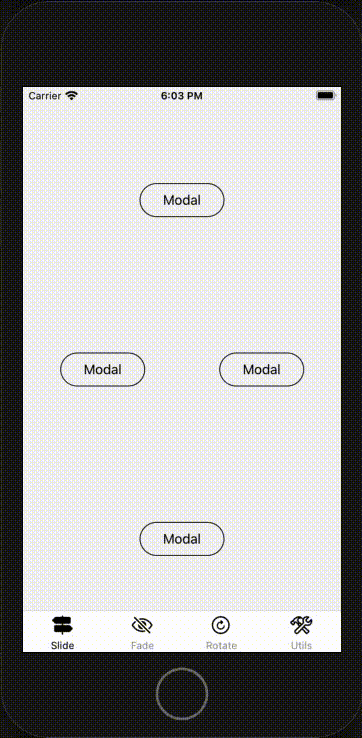

# React Native Modals Playground

## About

This repository is a playground for article about react-native modals which you can find on https://thewidlarzgroup.com/react-native-modals/.

This is an introduction to modals world. It contains examples of cool looking, fast and functional modal components, which you can freely implement into your project.

Run the playground and play with it on `master` branch, or checkout to `starter` branch and code by yourself to learn even more!

## Installation

1. Clone repository
2. Run `yarn`
3. For ios move to `cd ios` and run `pod install`
4. Run it on ios/android simulator or any physical device
5. Enjoy! 🙂

## Sneak peak

